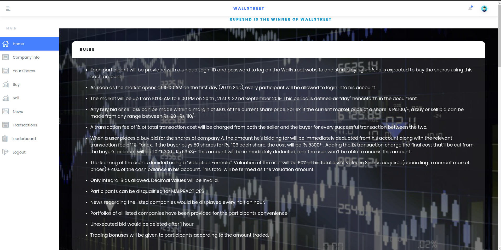

# Wallstreet

Wallstreet is a stock market simulator, where the players get an opportunity to earn truckloads of virtual money. All that the players have to do is, follow
the news, select the stock and wait for the price to skyrocket. On the flip side, they learn how to recover losses from stocks that have tanked.

The biggest takeaway from the Wallstreet is that the inexperienced players leave with a huge understanding about the stock market and are ready to step 
out into the street to make some real money!

This platform has been tested in a technical festival of PICT and can handle 1000+ players flawlessly.

Also Remember:
> When it is a question of money, everyone is of same religion.

## Rules
1. Each participant will be provided with a unique Login ID and Password to log on the Wallstreet website and start playing.
2. Any buy bid or sell ask can be made within a margin of ±10% of the current share price. For ex, if the current market price of a share is Rs.100/-, a buy or sell bid can be made from any range between Rs. 90/- Rs. 110/-
3. A transaction fee of 1% of total transaction cost will be charged from both the seller and the buyer for every successful transaction between the two.
4. When a user places a buy bid for the shares of company A, the amount he’s bidding for will be immediately deducted from his account along with the relevant transaction fee of 1%. For ex, if the buyer buys 50 shares for Rs. 106 each share, the cost will be Rs.5300/-. Adding the 1% transaction charge the final cost that’ll be cut from the buyer’s account will be 1.01 * 5300= Rs.5353/- This amount will be immediately deducted, and the user won’t be able to access this amount.
5. The Ranking of the user is decided using a **Valuation Formula**. Valuation of the user will be *60% of his total asset value in Shares* acquired(according to current market prices) + *40% of the cash balance* in his account. This total will be termed as the valuation amount.
6. News regarding the listed companies would be displayed every half an hour.
7. Portfolios of all listed companies have been provided for the participants convenience.
8. Unexecuted bid would be revoked after 1 hour.
9. Trading bonuses will be given to participants according to the amount traded.

## How to run locally
1. Go to the Project folder in your system
2. First do the entire setup
	- `pip install -r requirements.txt`
	- `sudo apt-get install redis-server`
3. Open the first terminal and start the redis-server by `redis-server` command
4. In another terminal start the Celery for the project `celery -A Wallstreet worker --pool=eventlet -l info`
5. In different terminal start the scheduler beat by `celery -A Wallstreet beat -l info`
6. Finally start the project server `python manage.py runserver`
7. Visit **http://localhost:8000** and now you are good to go
8. Register the players at **http://localhost:8000/register**

## Contributors
Purvesh Jain   
Kunal Chadha  
Bhushan Pagare   
Aditya Chaloo   
Manav Peshwani  

### You want to contribute ?
1. Fork the repo
2. Make the changes, add features
3. Send a pull request ):
